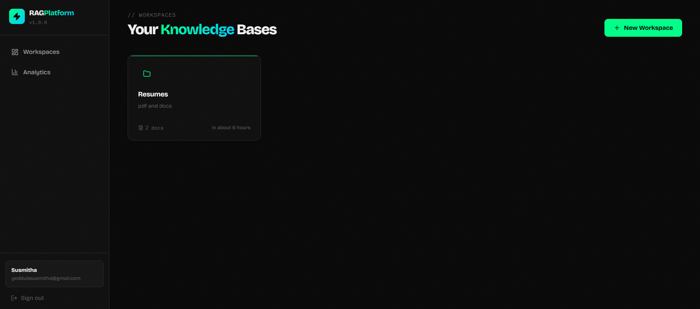
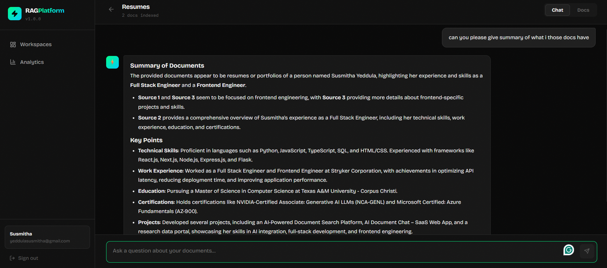
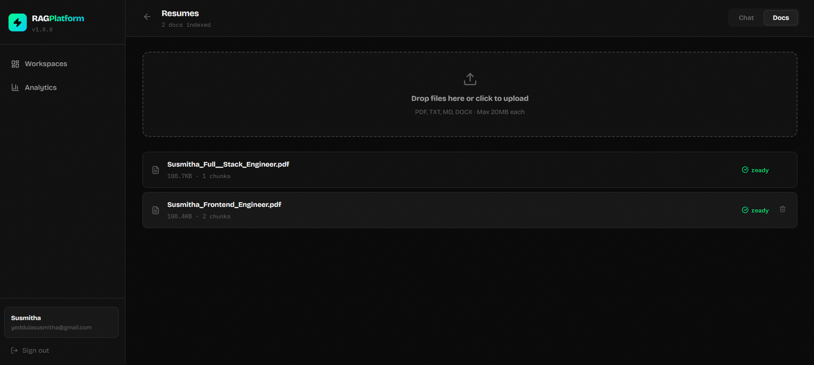

# RAG Platform 🚀

A **multi-tenant RAG (Retrieval-Augmented Generation)** document chat platform. Upload documents, create workspaces, and chat with your knowledge base using AI.

## 🌐 Live Demo

🔗 Frontend (Vercel):

https://rag-platform-1.onrender.com

🔗 Backend (Render):

https://rag-platform-mwu4.onrender.com

## 🖼 Preview






## Features

- 🔐 **JWT Authentication** — secure multi-tenant isolation
- 📁 **Workspace Management** — separate knowledge bases per project
- 📄 **Document Upload** — PDF, TXT, MD, DOCX support (up to 20MB)
- 🧠 **RAG Pipeline** — Sentence Transformers + ChromaDB vector search
- ⚡ **Fast LLM** — Groq (LLaMA 3.3 70B) for answer generation
- 🛡️ **Rate Limiting** — 20 req/min per user
- 📊 **Usage Analytics** — query history, response times, doc stats
- 🐳 **Docker** + **GitHub Actions CI/CD**

## Tech Stack

| Layer | Technology |
|-------|-----------|
| Backend | FastAPI, SQLAlchemy, aiosqlite |
| Auth | JWT (python-jose, passlib) |
| Embeddings | Sentence Transformers (all-MiniLM-L6-v2) |
| Vector DB | ChromaDB (persistent, local) |
| LLM | Groq API (llama-3.3-70b-versatile) |
| Frontend | React 18, Vite, Zustand, React Router |
| Deploy | Render (backend + static site) |

## Project Structure

```
rag-platform/
├── backend/
│   ├── app/
│   │   ├── api/          # auth, workspaces, documents, chat, stats
│   │   ├── core/         # config, database, auth, rate_limit
│   │   └── services/     # embeddings, vector_store, document_processor, rag
│   ├── requirements.txt
│   └── Dockerfile
├── frontend/
│   ├── src/
│   │   ├── pages/        # AuthPage, DashboardPage, WorkspacePage, StatsPage
│   │   ├── components/   # Layout
│   │   ├── store/        # authStore (Zustand)
│   │   └── api/          # axios client
│   └── Dockerfile
└── docker-compose.yml
```

## Local Setup

### Backend

```bash
cd backend

# Create venv
py -3.12 -m venv venv
venv\Scripts\activate          # Windows
# source venv/bin/activate     # Mac/Linux

# Install
venv\Scripts\python.exe -m pip install -r requirements.txt

# Configure
copy .env.example .env        # Windows
# cp .env.example .env        # Mac/Linux
# Edit .env and add GROQ_API_KEY

# Start
uvicorn app.main:app --reload
# API at http://localhost:8000
# Docs at http://localhost:8000/docs
```

### Frontend

```bash
cd frontend
npm install
npm run dev
# App at http://localhost:5173
```

### Docker (both together)

```bash
# Create .env in root with GROQ_API_KEY=...
docker-compose up --build
```

## API Endpoints

| Method | Endpoint | Description |
|--------|----------|-------------|
| POST | `/api/auth/register` | Register new user |
| POST | `/api/auth/login` | Login, get JWT |
| GET | `/api/auth/me` | Current user info |
| GET | `/api/workspaces/` | List workspaces |
| POST | `/api/workspaces/` | Create workspace |
| DELETE | `/api/workspaces/{id}` | Delete workspace |
| POST | `/api/documents/{ws_id}/upload` | Upload document |
| GET | `/api/documents/{ws_id}` | List documents |
| DELETE | `/api/documents/{ws_id}/{doc_id}` | Delete document |
| POST | `/api/chat/{ws_id}` | RAG query |
| GET | `/api/chat/{ws_id}/history` | Query history |
| GET | `/api/stats/` | Usage stats |
| GET | `/api/health` | Health check |

## Deploy to Render

### Backend (Web Service)
1. New Web Service → connect GitHub repo
2. Root directory: `backend`
3. Build: `pip install -r requirements.txt`
4. Start: `uvicorn app.main:app --host 0.0.0.0 --port $PORT`
5. Add env vars:
   - `GROQ_API_KEY` = your key from console.groq.com
   - `SECRET_KEY` = a long random string
   - `DATABASE_URL` = `sqlite+aiosqlite:///./rag_platform.db`
   - `GROQ_MODEL` = `llama-3.3-70b-versatile`

### Frontend (Static Site)
1. New Static Site → connect same repo
2. Root directory: `frontend`
3. Build: `npm install && npm run build`
4. Publish: `dist`
5. Add env var: `VITE_API_URL` = backend URL (e.g. `https://your-backend.onrender.com`)

## Get Groq API Key

1. Go to [console.groq.com](https://console.groq.com)
2. Sign up (free)
3. API Keys → Create new key
4. Copy and paste into `.env`

## Multi-Tenancy

Each user's workspaces are fully isolated:
- Database rows filtered by `user_id`
- ChromaDB uses separate collections per workspace
- JWT tokens tied to user ID — no cross-user data access possible
